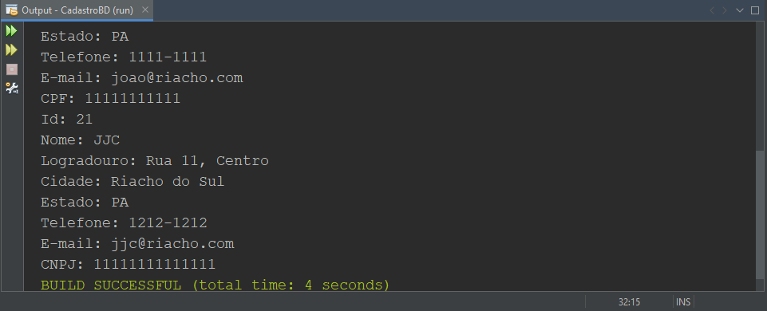
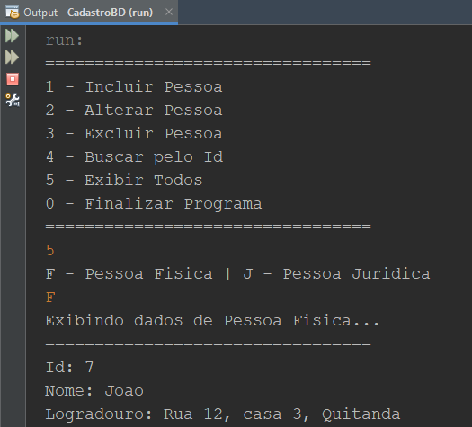
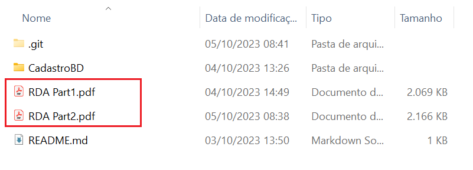
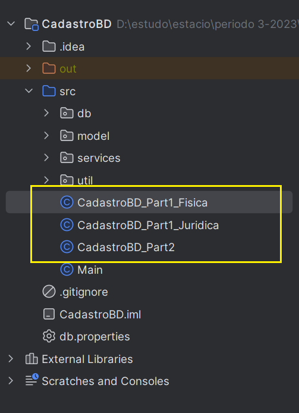
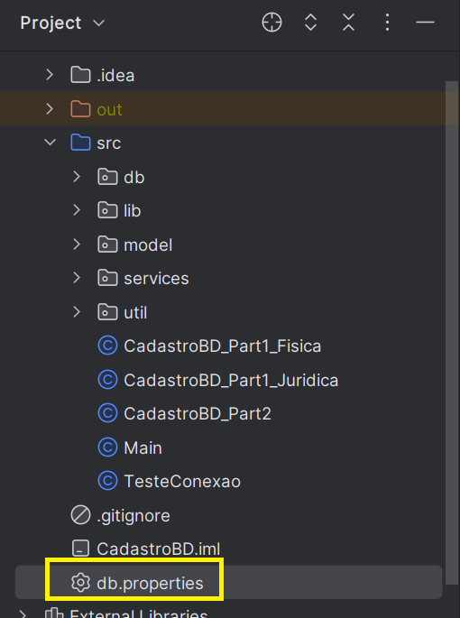
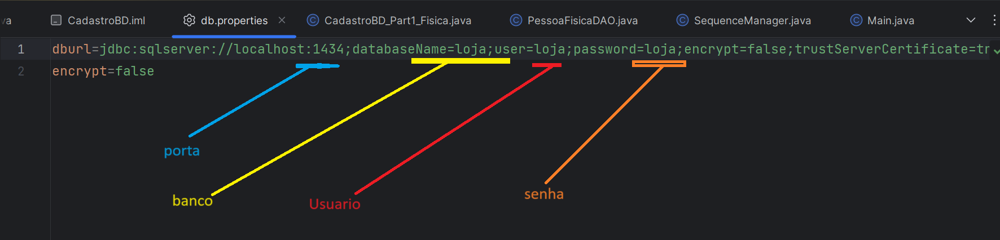

## Estacio| Missão Prática | Nível 3 | Mundo 3

## Descrição

 Aplicativo JAVA que implemente um CRUD utilizando como interface a interação via terminal ou prompt de comando onde é apresentando um menu de opções.
     

### Objetivos da prática

  - Implementar persistência com base no middleware JDBC.
  - Utilizar o padrão DAO (Data Access Object) no manuseio de dados.
  - Implementar o mapeamento objeto-relacional em sistemas Java.
  - Criar sistemas cadastrais com persistência em banco relacional.
   
### Procedimentos

- Os procedimentos são divididos em duas etapas

  -1º Procedimento | Mapeamento Objeto-Relacional e DAO
     -   Criar projeto que utilize o banco da missão anterior (n2)
     -   configurar a utilização do drive jdbc para o sql server
     -   criar classe PessoaFisica, PessaoJuridica com suas respectivas propriedades
     -   criar classes utilitarias de conexão e gerenciamento de sequences 
     -   criar classes DAO relativas as classes PessoaFisica e PessoasJuridica 
     -   organizar classes em pacotes
     -   gerar operações CRUD diretamente com as classes DAO   
     -   Gerar Relatório discente de acompanhamento (RDA Part1.pdf) 
      
   

 -  2º Procedimento | Criação do Cadastro em Modo Texto

     -   Adaptar a classe main() a apresentação de um menu de opções para execução do CRUD
     -   considerar tratamento de erro no input dos campos
     -   gerar operações CRUD diretamente pelo menu    
     -   Gerar Relatório discente de acompanhamento (RDA Part2.pdf)
    
   
     

 - Os relatórios podem ser encontrados na pasta raiz

     

- Observaçoes
   - A IDE utilizada foi Intellij IDEA
   - O jdk utilizado foi o 20
   - A execução do trabalho esta dividido em tres partes
      - CRUD Pessoa Fisca (Pratica parte 1)
        - execução do arquivo "CadastroBD_Part1_Fisica.java"
      - CRUD Pessoa Juridica (Pratica parte 1)
        - execução do arquivo "CadastroBD_Part1_juridica.java"
      - CRUD via menu (Pratica parte 2)
        - execução do arquivo "CadastroBD_Part2.java"
 
      
 
     ## configurando a conexão

       - localização do arquivo  db.properties

       
 
        - configuração das propriedades de conexão    
  
       

     
     ## Especificação
      https://sway.office.com/AHDBJjulH6tHFEIf?ref=Link&loc=play
    
   
